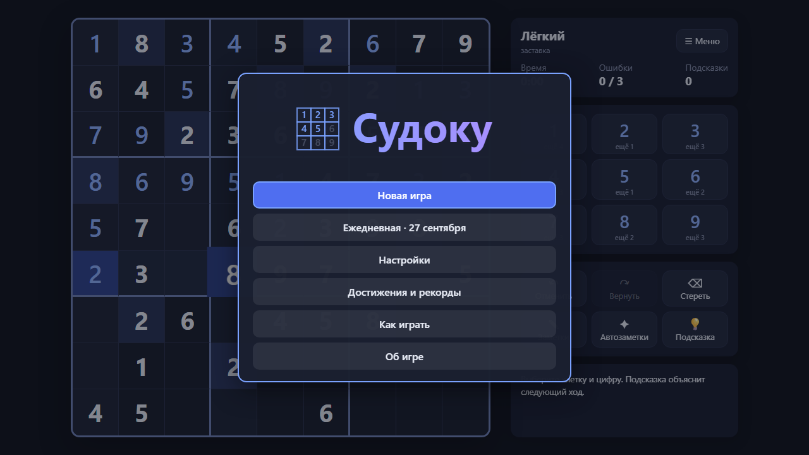
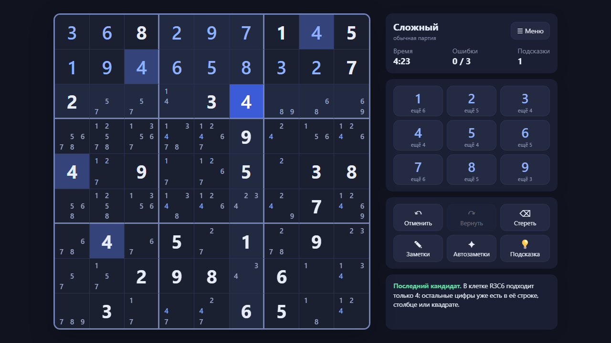
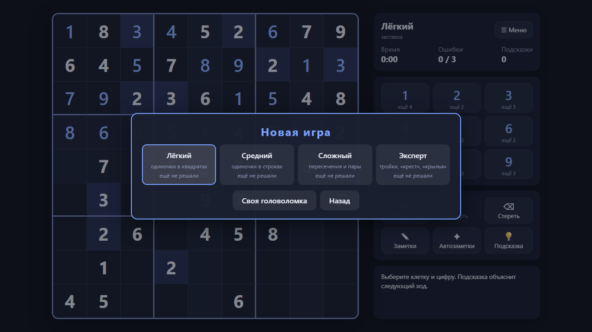

# SudokuGame - Sudoku

**English** · [Русский](README.ru.md)

**Sudoku** («Судоку») in a single HTML page: four levels by solving technique, hints that explain the technique, notes, pause and records. It runs in the browser with no server and no internet: open `index.html` or play it online.

**[▶ Play online](https://alexalesha.github.io/SudokuGame/)**

The interface is in Russian.







## What is in the game

- Puzzles are generated in the page; a bitmask solver checks that the solution is unique, a logical solver rates the level by human techniques.
- Levels: Easy (last candidate, single in a box), Medium (hidden singles), Hard (intersections, pairs), Expert (triples, X-wing, wings).
- A hint places one digit and explains the technique; if there is a mistake on the board, it shows it first.
- Notes and auto-notes, undo and redo, a daily puzzle shared by everyone that day, records per level, gamepad support.

## Controls

| Key | Action |
|---|---|
| Click or arrows, then a digit | fill a cell |
| N / Q | notes / auto-notes |
| Backspace | erase |
| Ctrl+Z / Ctrl+Y | undo / redo |
| H | hint |

Keys can be changed in the settings where the game offers it; a gamepad works too where noted above.

## Run locally

Open `index.html` in Chrome, Edge or Firefox. Everything is in the repository; nothing is downloaded.

## Tests

The laws are Playwright tests in `tests/`. They open the page by its file address in headless
Chromium, one at a time:

```
npm install
npx playwright install chromium
npm test
```

Mouse capture in the tests is always a stub (a real `requestPointerLock` in headless Chromium on
Windows can clip the user's cursor).
The pictures above were made headless by the screenshot script of the GameRoom collection.

## History

The game was made in the [GameRoom](https://github.com/ALEXalesha/GameRoom) collection (folder `web/sudoku`), where it also runs in the Igroteka launcher ([play there](https://alexalesha.github.io/GameRoom/)). This repository carries the game with its commit history.

## Licence

MIT, see [LICENSE](LICENSE).
